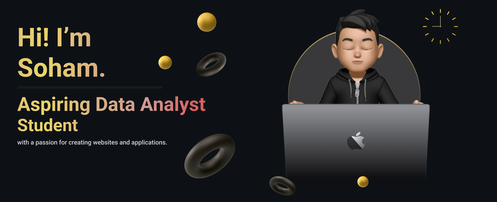

# 💫 About Me:
♂️ Soham Mokal, 21  📍 Mumbai, Maharashtra  🖥M.Sc Data Science student currently in First Year  👨🏻‍🎓 B.Sc.IT Graduate.  🗣  Head Co-ordinator of intercollegiate fest "BYTE IT"  💻 Editing Experience of more than 4 years on Adobe Premiere Pro and Adobe Photoshop

# 🌐 Socials:
    

# 📜 Certifications:
   
  
  
  
  
 

# 💻 Tech Stack:
                                      
# 🎨 Skills:
             

# 📊 GitHub Stats:
 
 

## 🏆 GitHub Trophies

### 🔝 Top Contributed Repo

  ## 💰 You can help me by Donating
    

  
<!-- Proudly created with GPRM ( https://gprm.itsvg.in ) -->
